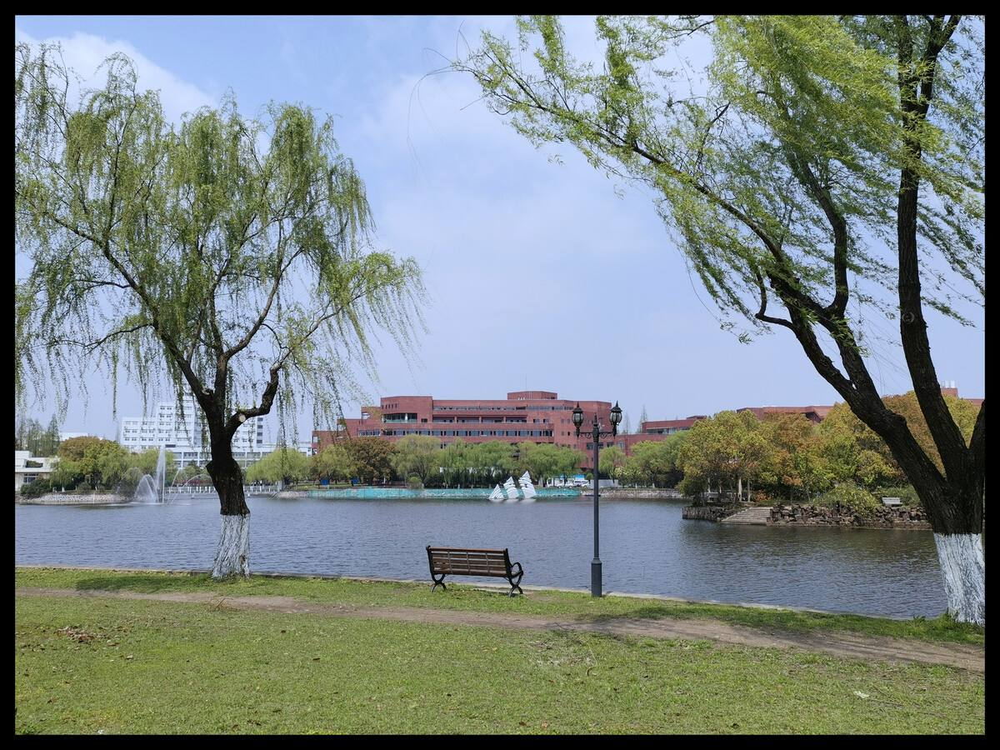

 <h1>Graduate Education - Ph.D.</h1> 

## Doctor of Philosophy: Statistics & Data Science
Cornell University Graduate School, Ithaca, NY 

- **Entered:** Fall 2018    
- **GPA:** 4.0/4.0
<!-- - List awards and achievements -->
- **Advisor:** [Dr. David S. Matteson](https://davidsmatteson.com/)
- **Research Assistantship Advisor:** [Dr. Martin Wells](https://stat.cornell.edu/people/faculty/martin-wells)

## Links

- [Cornell University](https://www.cornell.edu/)
  - [Cornell Ann S. Bowers College of Computing and Information Science (CIS)](https://cis.cornell.edu/)
    - [Department of Statistics and Data Science (DSDS)](https://stat.cornell.edu/)

 <h1>Undergraduate Education</h1> 

    
## Bachelors of Arts/Science: Mathematics & Applied Mathematics, Zhiyuan Honors Program

Shanghai Jiao Tong University, School of Mathematical Science, Shanghai, China

- **Graduated:** June 2018   
<!-- - List your achievements  -->
- **GPA:** 3.85/4.30  
- **Undergraduate Thesis**: "Test on Simultaneous Diagonalization of Random
Matrices"    
- **Thesis Advisor**: [Dr. Shan Luo](https://math.sjtu.edu.cn/Default/teachershow/tags/MDAwMDAwMDAwMLKIetw)

## Links

- [Shanghai Jiao Tong University](https://en.sjtu.edu.cn/)
  - [Zhiyuan Honors Program](https://en.zhiyuan.sjtu.edu.cn/)
<!-- - List cool things you did -->

