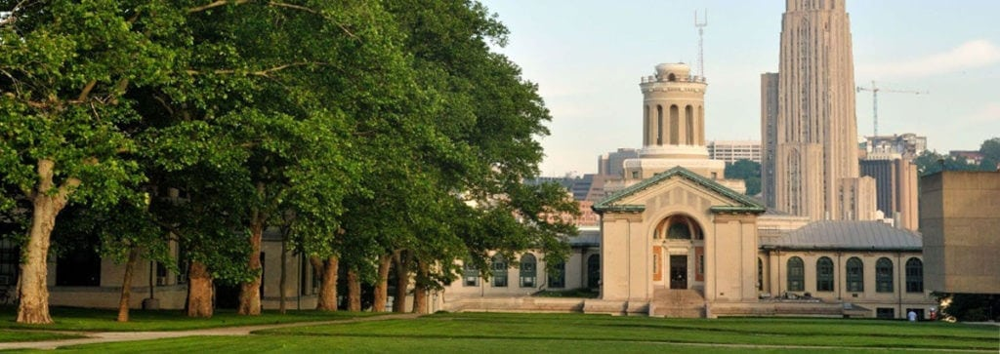

 <h1>Undergraduate Education</h1> 

    
## Bachelors of Arts/Science: Mathematics & Applied Mathematics, Zhiyuan Honor Program

Shanghai Jiao Tong University, Zhiyuan College, Shanghai, China

- **Graduated:** June 2018   
- List your achievements 
- **GPA:** 3.8  
- **Undergraduate Thesis**: "Title"    
- **Thesis Advisor**: [Dr. Shan Luo](https://www.cmu.edu/dietrich/psychology/people/core-training-faculty/helgeson-vicki.html)

## Articles and News

- [A student feature](https://www.cmu.edu/dietrich/news/news-stories/2018/may/kim-hochstedler.html) from graduation
- List cool things you did

